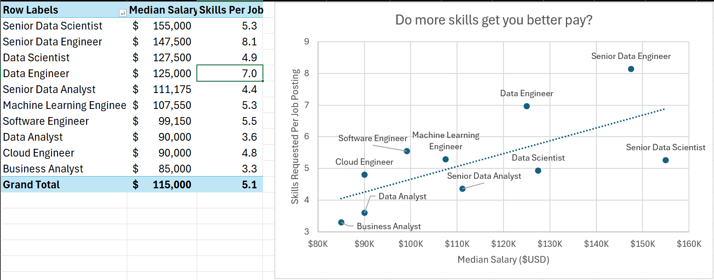
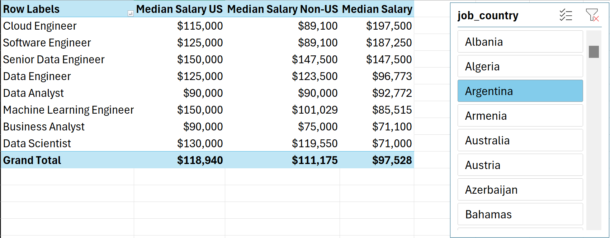
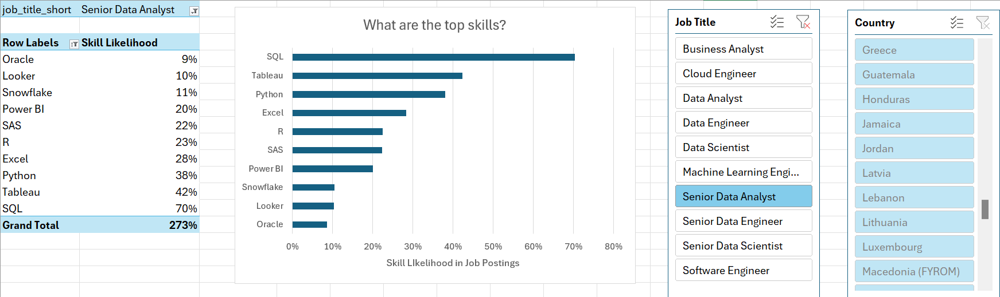
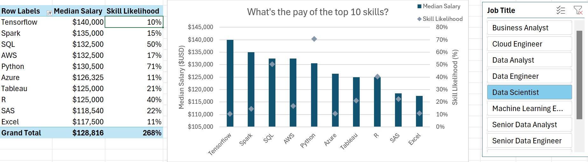

# Data Job Market Analysis (Excel)

Excel-based analysis of 2023 data job postings to understand how **skills, location, and job title** relate to compensation and demand. The workbook uses Excel’s data tools to model the dataset, summarize key metrics, and visualize insights.

## Project goals
This project answers four questions:
1. Do postings that request more skills tend to pay more?
2. How do salaries vary by role and region (US vs non-US)?
3. What skills are most commonly requested for data roles?
4. What is the pay associated with the top skills?

## Tools used (Excel)
- Power Query (data cleaning / ETL)
- Power Pivot (data model + relationships)
- PivotTables + PivotCharts
- DAX measures (median salary, region-specific metrics)

## Files
- `1_Project_Analysis.xlsx` — workbook (analysis + visuals)

## How to use
1. Open `1_Project_Analysis.xlsx` in Excel (Microsoft 365 / Excel 2021+ recommended).
2. Use slicers/filters (job title, region, etc.) to explore the views.
3. If visuals don’t update: **Data → Refresh All**.

## What’s inside (tabs)
- **Salary Analysis**: median salary by role (including US vs non-US comparison)
- **Skill / Job Analysis**: skill frequency by selected role
- **Skill / Salary Analysis**: salary patterns by skill
- **Salary vs Skills**: relationship between #skills requested and median salary

## Summary of insights
- Roles with higher specialization (e.g., senior engineering/science roles) tend to show higher median salaries.
- Common foundational skills include SQL and Python; cloud skills (e.g., AWS/Azure) appear frequently in postings.
- Skills tied to more technical roles generally correlate with higher median pay.

## Data source
Dataset provided through the associated Excel course and based on real-world job postings from 2023.

## Credits
Built while following [Luke Barousse's Excel course](https://www.lukebarousse.com/excel).

## Author
Jonathan Tejeda
